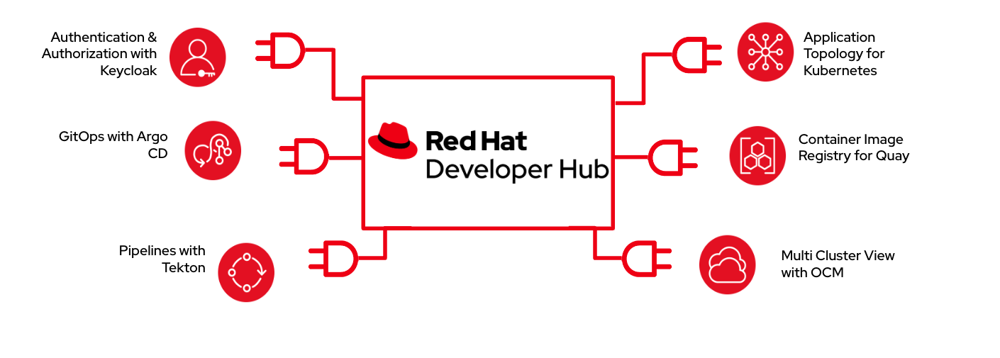

# Red Hat Developer Hub Architecture Diagram

## Overview

The Red Hat Developer Hub (RHDH) is designed to streamline developer workflows by providing a centralized platform for accessing tools, documentation, and services. Its architecture leverages modern cloud-native principles to deliver a scalable, secure, and extensible environment for developers. Below, we explore the high-level architecture diagram, the major components, and their respective roles within the system.

---

## High-Level Architecture

### Key Components:

1. **User Interface (UI)**
   - The Developer Hub's front-end is a web-based portal designed for ease of use, providing developers with access to tools, project resources, and documentation. Built with modern JavaScript frameworks, the UI interacts with backend services via REST or GraphQL APIs.

2. **Backend Services**
   - Backend services handle user authentication, resource management, and data aggregation. These microservices are containerized and orchestrated by Kubernetes. Each service performs distinct functions such as user management, project tracking, and integration with external tools.

3. **API Gateway**
   - The API Gateway acts as the entry point for all client requests, routing them to the appropriate backend services. It ensures security through authentication and authorization, and provides features such as request throttling and caching.

4. **Identity Management & Single Sign-On (SSO)**
   - Red Hat Developer Hub integrates with Red Hat’s Identity Management (IdM) solution, enabling SSO for all connected services. This provides a seamless login experience for developers across Red Hat and external tools.

5. **OpenShift Container Platform**
   - The core of the architecture is powered by Red Hat OpenShift, which provides container orchestration, deployment automation, and lifecycle management. OpenShift ensures that all services run in isolated, scalable containers, allowing for dynamic scaling based on user demand.

6. **Tekton Pipelines**
   - For CI/CD, the Developer Hub uses Tekton Pipelines, which provides a Kubernetes-native framework for building, testing, and deploying applications. This ensures that development workflows are streamlined, and new features can be delivered quickly.

7. **GitOps Management**
   - GitOps principles are applied to manage configurations and application states. Tools such as ArgoCD or OpenShift GitOps are used to ensure that desired states are defined in version-controlled repositories and automatically synchronized with the live environment.

8. **Artifact Repository**
   - The Hub integrates with JFrog Artifactory or other artifact repositories for storing and managing build artifacts like containers, libraries, and binaries. This ensures that developers can easily access and reuse components across projects.

9. **Observability Stack**
   - Monitoring and logging services such as Prometheus and Grafana are used to track the health and performance of the platform. Logs from the services are collected and aggregated via the OpenShift Logging stack (ELK/EFK) for troubleshooting and auditing purposes.

10. **Red Hat Service Integrations**
    - The Hub is integrated with several Red Hat services, including Red Hat OpenShift Pipelines, Quay (container registry), and OpenShift Service Mesh for networking between services. These integrations provide additional value to developers by centralizing access to powerful tools within the Hub.

11. **External Tool Integrations**
    - The Developer Hub connects to external tools like GitHub, Jira, and SonarQube to offer a full end-to-end development lifecycle. Developers can configure these integrations directly from the Hub for enhanced productivity.

---

## Benefits of Red Hat Developer Hub Architecture

1. **Scalability:**
   - Built on OpenShift, the platform can scale horizontally, ensuring that it can handle a growing number of users and workloads with ease.

2. **Security:**
   - With integrated identity management and SSO, the platform ensures that user data and credentials are handled securely across all services.

3. **Extensibility:**
   - The modular nature of the architecture allows for easy integration of new services and tools as developer needs evolve.

4. **Developer Efficiency:**
   - By centralizing key tools and services, the Developer Hub simplifies the workflow for developers, reducing context-switching and boosting productivity.

5. **DevOps and GitOps Friendly:**
   - With support for Tekton Pipelines, GitOps, and Kubernetes-native operations, the architecture is aligned with modern DevOps practices, ensuring efficient and automated deployments.

---

## Conclusion

The Red Hat Developer Hub is built on a robust and scalable architecture that aligns with cloud-native principles, providing developers with a centralized, secure, and efficient platform for their development needs. By leveraging OpenShift, Tekton, and integrated Red Hat services, the Hub empowers teams to focus on building and delivering innovative solutions with greater speed and reliability.

For further details on specific components or integration options, refer to the respective sections of this documentation.
